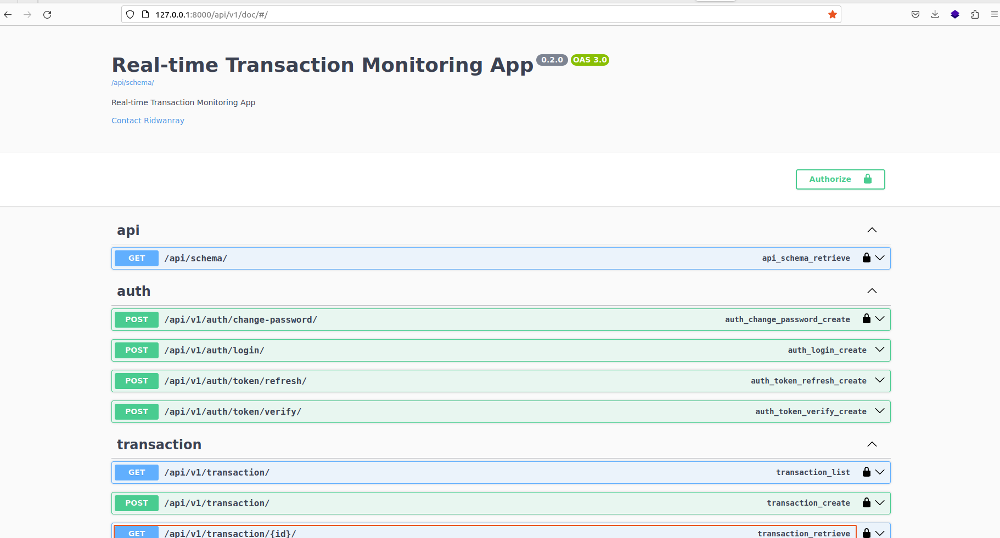
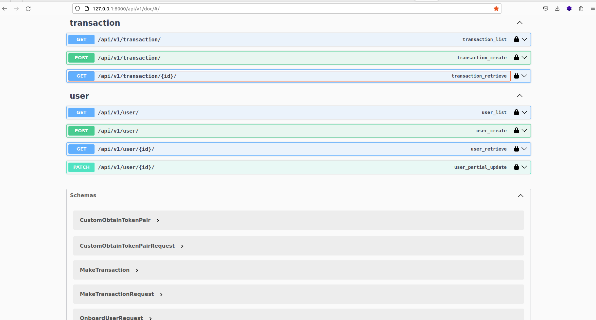
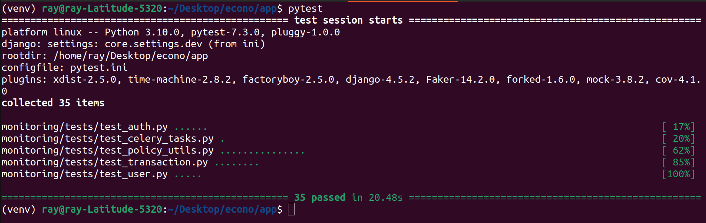
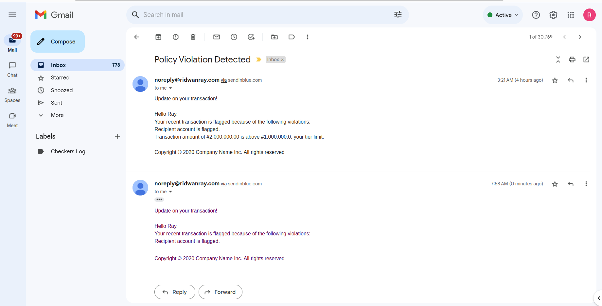

# Real-time Transaction Monitoring App
This system evaluate policies and  send notifications via email when certain conditions are met

## Tools & Services:
- Django & DRF : for building the APIs
- Docker & Docker compose: Containerization
- Celery: For running background task asynchronously(e.g. sending email)
- Rabbit MQ: A message broker for celery
- Flower dashboard: For monitoring celery background tasks
- SQLite: Relational DB

## Running locally

Create a .env file by copying the .env.sample provided and run:

```
docker-compose -f docker-compose.dev.yml up --build
```
to build and run the container using the dev yaml file.

Access docs:
```sh
http://localhost:8000/api/v1/doc
```

<br><br><br>

<br><br><br>


## Running In a Virtual Env

Create a virtual environment using:
```
python3 -m venv venv
```

```
pip install -r app/requirements/dev.txt
```

Navigate to app directory and run migrations using:

```
python manage.py makemigrations

python manage.py migrate
```

Run the server using:
```
python manage.py runserver
```

Start celery worker process in an activated virtualenv at the app dir by running:
```
celery -A core worker --loglevel=info
```


## Run tests
Run descriptive tests in the container using:
```
docker compose exec <docker_container_name> pytest
```

or Run test in the app dir for activated an virtualenv using:

```
pytest -rP -vv
```

# Test Output


# Email Notification


# Worflow
- Create account on the system
- Login with valid credentials to retrieve auth token
- Initiate transaction with specified amount & recipent (This endpoint handles webhook integration)
- If policies are violated, transaction is flagged and email notication is sent to sender
